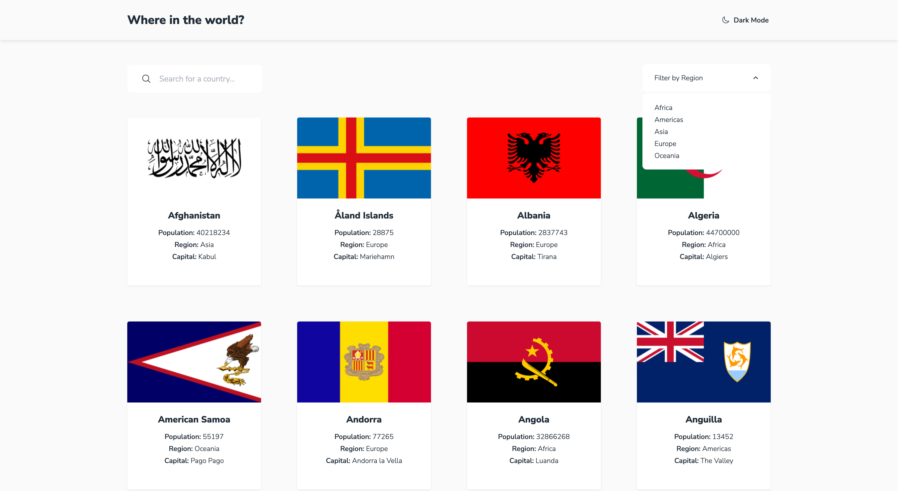

# Frontend Mentor - REST Countries API with color theme switcher solution

This is a solution to the [REST Countries API with color theme switcher challenge on Frontend Mentor](https://www.frontendmentor.io/challenges/rest-countries-api-with-color-theme-switcher-5cacc469fec04111f7b848ca). Frontend Mentor challenges help you improve your coding skills by building realistic projects.

## Table of contents

- [Overview](#overview)
  - [The challenge](#the-challenge)
  - [Extra challenges I set myself](#extra-challenges-i-set-myself)
  - [Screenshot](#screenshot)
  - [Links](#links)
- [My process](#my-process)
  - [Built with](#built-with)
  - [What I learned](#what-i-learned)
  - [Continued development](#continued-development)
- [Author](#author)

## Overview

### The challenge

Users should be able to:

- See all countries from the API on the homepage
- Search for a country using an `input` field
- Filter countries by region
- Click on a country to see more detailed information on a separate page
- Click through to the border countries on the detail page
- Toggle the color scheme between light and dark mode *(optional)* (completed)

### Extra challenges I set myself

- Make app navigable by just keyboard
- Focus search box when app loads so user can start typing immediately
- Set light or dark mode based on user preference or earlier decision
- Don't show redundant text, like "Capital:" if there is no capital
- Click on "Where in the world?" to return to home screen

### Screenshot



### Links

- [Solution](https://countriesdrlc.netlify.app/)

## My process

### Built with

- Semantic HTML5 markup
- [Tailwind CSS](https://tailwindcss.com/)
- Mobile-first workflow
- [React](https://reactjs.org/) - JS library

### What I learned

For keyboard navigation, I used a `button` for all clickable elements. You can then tab between countries and select a country using the space or enter key.

When I started this project, I tried to handle both the mobile and desktop layouts at the same time. After a while, I realised it was easier to focus on the more simple mobile design first, and then add the desktop design afterwards.

Adding dark mode presented a few challenges. I noticed that in dark mode the bottom of the page was white rather than dark, because I'd used `margin` rather than `padding`. I also learnt it's important to set your light and dark colours as high up in the DOM hierarchy as possible.

### Continued development

I'm still learning the best way to use Tailwind. While it's very quick and easy to add Tailwind classes, it's not so easy to spot when one of these classes has become redundant. This is why next time around I will focus just on the mobile design first, and try to add classes more cautiously.

Tailwind also made my code a bit harder to scan. To make things easier, I started using comments to introduce a section, such as "Search for a country", "Filter by region", and "Countries and flags". This helped a bit, but JSX comments don't appear when you inspect the page, so I might instead introduce a section using a class, like this:

```html
<div class="countries-wrapper mx-4 px2 etc..."
```

## Author

- Frontend Mentor - [@danielrlc](https://www.frontendmentor.io/profile/danielrlc)
